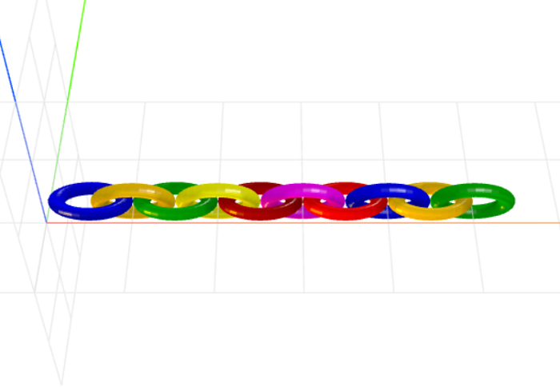

# alternate-layout
Parameterized alternating rotate layout for CraftML

### Install
    $ npm install alternate-layout

### Parameters
- degrees: adjusts degree of rotation
- axis: adjusts axis of rotation

### Example
```html
<craft name="chain">
    <craft name="ring" module="@gist/doubleshow/f40c4180484371c57585"/>
    <craft name="alternate-layout" module="alternate-layout"/>

    <row spacing="-5">
        <alternate-layout>
            <repeat n="10">
                <ring radius="5" thickness="2" transform="
                     scale(1,0.5,1)"></ring>
            </repeat>
        </alternate-layout>
    </row>
</craft>
```

